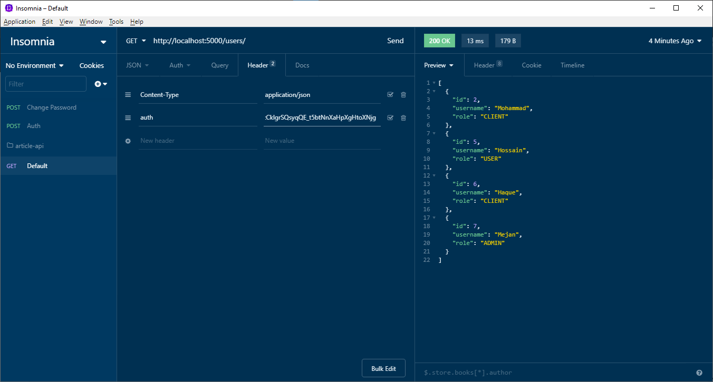

# JWT Authentication with TypeORM, Express, Sqlite

## Working with authentication

> To get the jwt token type username & password like the sc below and send post req

> To pass the authentication fill the Headers like the sc below with auth(name) & token(value)
>
> 

## Steps to seed a default admin user

Now, let’s create our first migration

    typeorm migration:create -n CreateAdminUser

Then, we are going to modifie the generated file:

    import { MigrationInterface, QueryRunner, getRepository } from "typeorm";
    import { User } from "../entity/User";

    export class CreateAdminUser1547919837483 implements MigrationInterface {
    public async up(queryRunner: QueryRunner): Promise<any> {
        let user = new User();
        user.username = "admin";
        user.password = "admin";
        user.hashPassword();
        user.role = "ADMIN";
        const userRepository = getRepository(User);
        await userRepository.save(user);
    }

    public async down(queryRunner: QueryRunner): Promise<any> {}
    }

Now we start the server, so the synchronize tool can generate our database tables.

    npm start

Now we can run the migration, to insert the first admin user.

    npm run migration:run

## Source Links

Blog: https://medium.com/javascript-in-plain-english/creating-a-rest-api-with-jwt-authentication-and-role-based-authorization-using-typescript-fbfa3cab22a4

Github: https://github.com/andregardi/jwt-express-typeorm

## Steps to run this project:

1. Run `npm i` command
2. Setup database settings inside `ormconfig.json` file
3. Run `npm start` command
